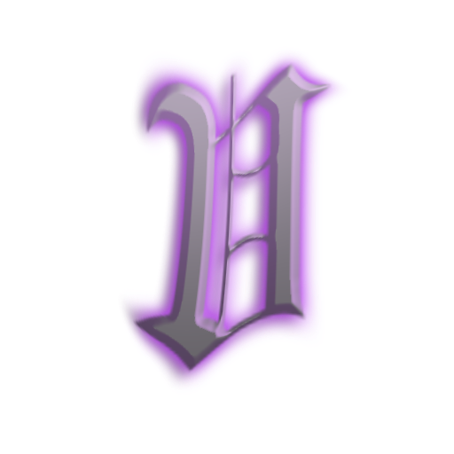

<h1 align="center">🎯 viewX 🎯</h1>

  

  <b>Version 0.0.2</b> &bull; <i>Crosshair system with heavy customizability for Roblox games.</i>

---

## 🕶️ What is viewX?

**viewX** is a in development crosshair tool giving you lots of control over your crosshair for completely free, offering robust customization and easy to use UI, viewX is perfect for most FPS games. Not to mention, it's also completely free! (At least for the moment, no plans on making it not free right now)

---

## 🌌 Features

- 🎯 **High Customizability** – Adjust size, shape, gap, thickness, style, and so much more
- 🎨 **Color Variety** – Choose any crosshair / outline color
- 💾 **Presets & Profiles** – viewX offers many different presets / types of crosshairs, suitable for every scenario
- 🖼️ **Custom Crosshair Images** – Upload images to use as your crosshair, still customizeable using settings
- 🔄 **Flawless Overlay** – Display your crosshair over any screen, with no interference to your gameplay
- 🧩 **Simple UI** – UI designed to be simple, effective, and fast to configurate

---

## 🌒 Ideal For

- Roblox FPS games
- Casual and competitive players
- People wanting more control over their crosshair

---

## 📦 Installation

**viewX** is currently in development - if you are reading this, and you aren't me (view) - (impossible), release will be implemented once I add security checks and other systems to ensure the integrity of the code, and possibly sign the exe file.

---

## 📌 Showcase

*Later.*

---

## ⚖️ License

viewX - Copyright (c) 2025 @actuallyview / View

This software is proprietary and confidential. All rights reserved.

Unauthorized copying, distribution, modification, decompilation, reverse engineering, or use of this software or any portion of it is strictly prohibited.

You may only use this software in its original, unmodified form, as provided by the author. **By using this software, you agree to these terms.**

---

  <i>Built so the Roblox community can get better aim 🎯</i>

